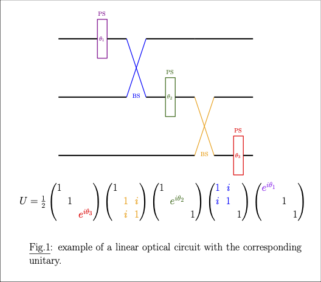
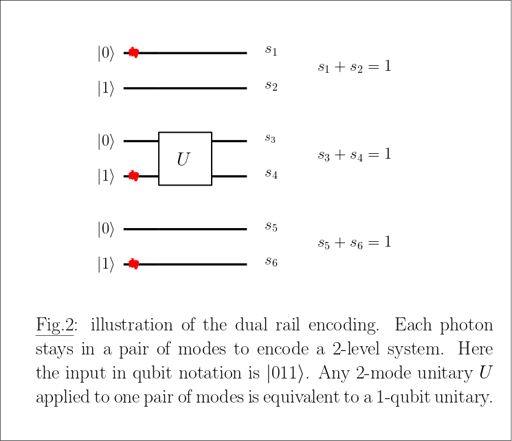
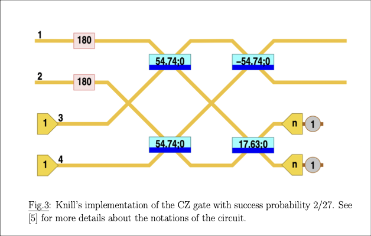
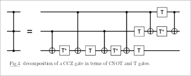
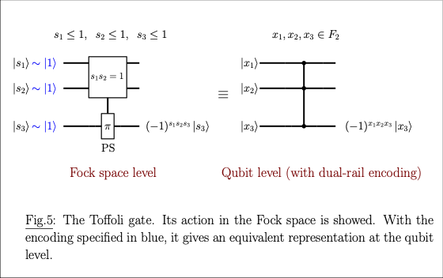
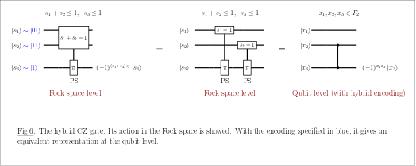

#### 1. Quick overview of linear optics

Linear optics describe the evolution of photons passing through a linear interferometer. Given a circuit with $m$ modes and $n$ photons, we use the Fock state notation 
$$\ket{s_1,s_2, ..., s_m}, s_1+s_2+...+s_m = n$$ 

to represent a state with $s_1$ photons in mode $1$, up to $s_m$ photons in mode $m$ and we note $\Phi_{m,n}$ the set of possible $n$-photon $m$-mode Fock states.

Equivalently, a Fock state can be written as the result of creation operators $a^{\dagger}$ on each mode applied to the vacuum state. The generic formula is 

$$ a^{\dagger}\ket{n} = \sqrt{n+1} \ket{n+1}$$ 

such that 

$$\ket{s_1, s_2, ..., s_m}= \frac{1}{\sqrt{s_1! s_2! ... s_m!}} (a_1^{\dagger})^{s_1} (a_2^{\dagger})^{s_2} ... (a_m^{\dagger})^{s_m} \ket{000...0}.$$ 

When the photons pass through a linear interferometer, the evolution is modeled as applying unitary linear transformations to the creation operators. In other words, there exists a unitary operator U that applies the transformations 

$$ a_i^{\dagger} \to \sum_{j=1}^m u_{ji} a_j^{\dagger} $$  

and the output state is given by 

$$ \ket{\psi_{out}} = \frac{1}{\sqrt{s_1! s_2! ... s_m!}} \prod_{i=1}^n \bigg(\sum_{j=1}^m u_{ji} a_j^{\dagger} \bigg)^{s_i} \ket{000...0}.$$ 

Developping the product gives a linear superposition of Fock states:

$$ \ket{\psi_{out}} = \frac{1}{\sqrt{s_1! s_2! ... s_m!}} \sum_{t \in \Phi_{m,n}} \alpha_t \sqrt{t_1!...t_m!} \ket{t_1,t_2,...,t_m}.$$ 

For more details about the formalism see [1]. 

**Perceval information** 

Given $U$ and an input state $\ket{s}$, Perceval can compute for you the coefficients $\alpha_t \sqrt{t_1!...t_m!}$ with two backends: 
- the Naive backend which gives you one specific coefficient for a chosen $\ket{t}$,
- the SLOS backend which gives you all coefficients. 

#### 2. Linear optical circuits 

The unitary operator applied can be itself described as a linear optical circuit made of constant beam splitters and parameterized phase shifters arranged in a fixed architecture also called a chip. A beam splitter (BS) applies the 2-mode unitary transformation 

$$ \begin{pmatrix} 1 & i \\\ i & 1 \end{pmatrix} $$ 

and a phase shifter (PS) parameterized by an angle $\theta$ applies the 1-mode transformation 

$$ \begin{pmatrix} 1 & \\\ & e^{i\theta} \end{pmatrix}. $$

An example of circuit is given in Fig.1 with the corresponding unitary applied. 

<p align="center">

</p> 

Similarly to quantum circuits, the sequential composition is equivalent to matrix/matrix products. Where it differs is in the spatial composition where the direct sum is used.  Theoretical results guarantee that some chips are universal in the sense there always exists a set of angles of the beam splitters and phase shifters to implement any desired operator U [2,3].

**Perceval information**

Perceval can generate such universal chips for you and choose the angles to implement the unitary of your choice. You can also easily iterate through the angles of the circuits to choose yourself the unitary to apply. Then you can call Perceval's backends to perform some simulations .

#### 3. Probabilistic gates for NISQ 

For near-term applications, photonic hardware essentially relies on using a chip with an encoding to mimic the quantum circuit approach. For instance, in the dual rail encoding, one qubit is encoded as a photon that can be in two different spatial modes (thus encoding the $\ket{0}$ and $\ket{1}$ states) and the concatenation of $n$ photons with $2n$ modes gives an $n$-qubit quantum system. Note that at any moment each photon stays in its pair of modes.

<p align="center">

</p> 

If one-qubit gates can be easily implemented by doing some local 2-mode operations (see Fig.2), unfortunately it is known that entangling 2-qubit gates cannot be implemented with the use of linear optics only. We need auxiliary modes and photons and some postselection schemes on the auxiliary modes to implement entangling gates [4]. Roughly, with auxiliary photons and modes, the output state is now a sum of a desired state (on which the correct 2-qubit gate has been applied) and a garbage state 

$$ \ket{\psi} = \alpha \ket{\psi_{desired}}\ket{s} + \sum_{s' \neq s} \beta \ket{\psi_{garbage, s'}} \ket{s'} $$

and we need to measure the register $\ket{s}$ to postselect on having measured $s$. This results in a probabilistic operation with probability of success $|\alpha|^2$ which prevents large quantum circuits to be executed because the probability of success decreases exponentially with the number of two-qubit gates. 

For instance, in the dual rail encoding, one can check that implementing a CZ gate between two qubits is equivalent to implementing a CZ gate between two modes, the modes encoding the state $\ket{1}$ of both qubits. A phase of (-1) is applied if we have one photon in each mode, i.e, 

$$ CZ \ket{s1,s2} = (-1)^{s1s2} \ket{s1, s2}, s1, s2 <= 1 $$ 

with **Fock state** notations. The constraints $s_1, s_2 \leq 1$ are ensured by the fact that we are in dual rail encoding such that only one photon can be found in one mode. 

So far, the best known scheme to do a CZ gate is Knill's version given in Fig.3 that has a probability of success of 2/27 [5]. It requires two extra photons, two extra modes and the gate is implemented if one photon is detected in each auxiliary mode.

<p align="center">

</p> 

The matrix of the circuit is 

$$ U = \begin{pmatrix} -1/3 & -\sqrt{2}/3 & \sqrt{2}/3 & 2/3 \\\ \sqrt{2}/3 & -1/3 & -2/3 & \sqrt{2}/3 \\\ -\sqrt{3+\sqrt{6}}/3 & \sqrt{3 - \sqrt{6}}/3 & -\sqrt{(3+\sqrt{6})/2}/3 & \sqrt{1/6 - 1/(3\sqrt{6})} \\\ -\sqrt{3-\sqrt{6}}/3 & -\sqrt{3+\sqrt{6}}/3 & -\sqrt{1/6-1/(3\sqrt{6})} & -\sqrt{(3+\sqrt{6})/2}/3\end{pmatrix}.$$ 


One can check that for any input $\ket{s1,s2}$ on the first two modes, $s_1, s_2 \leq 1$, we get an output of the form 

$$ (-1)^{s_1s_2} \sqrt{\frac{2}{27}} \ket{s_1,s_2} \ket{1,1} + \alpha \ket{*}\ket{0,0} + \beta \ket{*}\ket{0,1} + \gamma \ket{*}\ket{1,0} $$

and postselecting on the two auxiliary modes ensures we get the correct result.

#### 4. Goal of the challenge 

The goal of this challenge is to better understand the link between the linear optical circuit as a unitary on the modes and the resulting unitary operator on the Fock space and how we can design the search of more complex linear optical gates. To assess the quality of your work, we propose two $3$-mode linear optical gates to implement. 

- the CCZ gate. At the qubit level, a CCZ gate applies the operation 

$$ CCZ \ket{x_1, x_2, x_3} = (-1)^{x_1x_2x_3} \ket{x_1, x_2, x_3} $$ 

and one can check that with a dual rail encoding this is equivalent, at the mode level, to the gate 

$$ CCZ \ket{s_1, s_2, s_3} = (-1)^{s_1s_2s_3} \ket{s_1, s_2, s_3},  s_1, s_2, s_3 \leq 1$$

where the modes $s_1, s_2, s_3$ are the ones encoding the state $\ket{1}$ of the three qubits.

Using standard circuit decomposition, the CCZ gate can be implemented as in Fig.4 with 6 CNOT gates but it is costly in terms of extra resources and success probability. You can still use it to check your code. 

In [6], they investigate the numerical search of a Toffoli gate, with promising results. However they do not provide a linear optical to check their result. You can start by trying to reproduce their results before improving on their work. 

<p align="center">

</p> 

- a special CZ gate in an hybrid qubit encoding. We sligthly deviate from the dual rail encoding. Two qubits are encoded in one photon and 4 modes and a third qubit is encoded as one photon with 2 modes. We want to apply a CZ gate between one of the first two qubits and the third qubit. Without loss of generality, let's assume we want to do CNOT(2,3). At the Fock state level, given the modes that encode the states $\ket{01}$ and $\ket{11}$ of the first two qubits (resp. $s_1$ and $s_2$) and the third mode that encodes the state $\ket{1}$ of the third qubit ($s_3$), we want to do the operation 

$$ \ket{s_1,s_2,s_3} \to (-1)^{(s_1 + s_2)s_3} \ket{s_1,s_2,s_3}. $$

This operation can be rewritten as 

$$ \ket{s_1,s_2,s_3} \to (-1)^{s_1s_3} (-1)^{s_2s_3} \ket{s_1,s_2,s_3} $$

which is equivalent to applying two CZ gates. Can we do better with a direct implementation? 

Fig.5 and Fig.6 gives a recap of the two gates we are looking for in a Fock state formalism.

<p align="center">

</p> 

<p align="center">

</p> 

Note that the behavior of the gates is not defined for larger number of photons. We do not care as these cases will never happen if we stay in the chosen encoding.

**Insights**

Both analytical and numerical work are promising leads. Feel free to choose the ones you prefer/feel is the more promising! Keep in mind that analytical work, if they do not end up with a practical result, will be harder to judge than numerical results. 

**Suggested guideline**

1. Start by reproducing the results from [5]. Do not necessary follow the exact same method. The goal is to have a code that can recover a CZ gate with success probability 2/27. 
2. Then reproduce the results from [6], either by applying your method from Question 1 or by designing a new method. 
3. More exploratory work is to find better implementations for both the Toffoli and the CZ gate in hybrid encoding.
4. Any theoretical result is welcomed! Proofs that the current implementations are optimal with respect to any metrics (success probability, number of photons, etc.) are of particular interest.

**Work evaluation**


#### References 

[1] Aaronson, S., & Arkhipov, A. (2011, June). The computational complexity of linear optics. In Proceedings of the forty-third annual ACM symposium on Theory of computing (pp. 333-342).

[2] Reck, M., Zeilinger, A., Bernstein, H. J., & Bertani, P. (1994). Experimental realization of any discrete unitary operator. Physical review letters, 73(1), 58.

[3] Clements, W. R., Humphreys, P. C., Metcalf, B. J., Kolthammer, W. S., & Walmsley, I. A. (2016). Optimal design for universal multiport interferometers. Optica, 3(12), 1460-1465.

[4] Knill, E., Laflamme, R., & Milburn, G. J. (2001). A scheme for efficient quantum computation with linear optics. nature, 409(6816), 46-52.

[5] Knill, E. (2002). Quantum gates using linear optics and postselection. Physical Review A, 66(5), 052306.

[6] Uskov, D. B., Kaplan, L., Smith, A. M., Huver, S. D., & Dowling, J. P. (2009). Maximal success probabilities of linear-optical quantum gates. Physical Review A, 79(4), 042326.


```python

```
